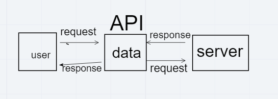

# Project Name

**Author**: Abdulrahman Abughniem
**Version**: 1.0.0

## Overview

The application is responseble of viewing the location of a city of the user selection and add information about the city including a static map.

## Getting Started

1. Create a github rebo
2. Install React app on the repo (npm i react-app)
3. Instal npm backges (bootstrab,axios)
4. Start coding
5. Deploy on netlify
6. create github repo for the Backend
7. use Heroku for backend debloyment

## Architecture
<!-- Provide a detailed description of the application design. What technologies (languages, libraries, etc) you're using, and any other relevant design information. -->
1. JS
2. React
3. React-bootstarp(Forms)
4. axios
5. API
6. Express.js
7. Cors

## Block Diagram

<!-- Use this area to document the iterative changes made to your application as each feature is successfully implemented. Use time stamps. Here's an example:

01-01-2001 4:59pm - Application now has a fully-functional express server, with a GET route for the location resource. -->

## Credit and Collaborations

1. LocationIQ providing a free API
2. Rula Al-Qasem Help in first stages.
3. mariam odat - contreputer.
4. Dania abughoush - contreputer.
5. themoviedb free API for Movies.
